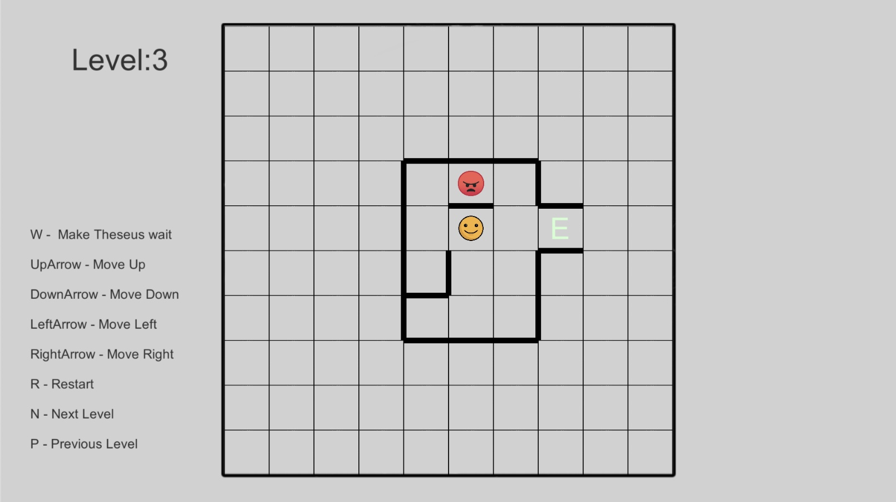
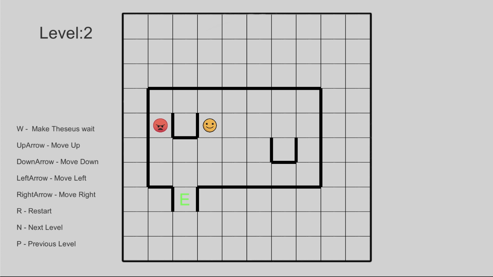
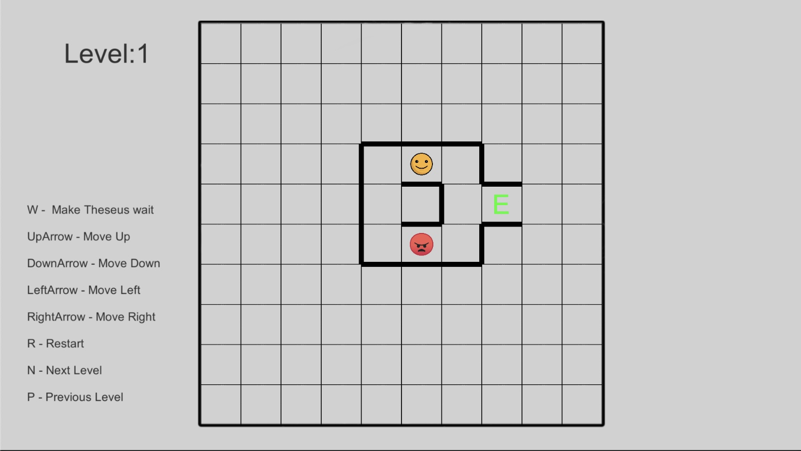

# Theseus and the Minotaur
* This is a sample unity project, its a Theseus and the Minotaur algorithm.

# How it works
* The idea is to get Theseus to the exit without him being eaten by the Minotaur (the black circle).
* For each move that Theseus makes, the Minotaur makes two moves. He always tries to get closer to Theseus.
* It he can move one square horizontally and get closer, he will do that. 
* If he can’t move horizontally, then he will try to move vertically.

### Photos of The Game

   

